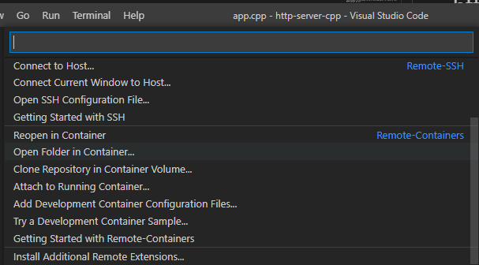

# http-server-cpp
This project is intended to be a starting point for build a fast HTTP server in C++.
By this moment is in a Proof of Concept stage

### Requisites
- Docker or your preferable containers engine for local development

### Optional but I Strongly reccomend
- Visual Stucio Code.
- Remote Containers extension for Visual Studio Code

Either otion you selected (with or without Visual Studio Code), the Dockerfile inside .devcontainer folder has all the necesary for build and execute the cpp server.

If you went for Remote Containers option, you just click on bottom left corner.

Then select Open or Reopen in container.

That's all you need.

Now for those that are comming from NodeJS, you can just run:

<code> npm start </code>

Now you will have an HTTP server ready running on port 8080

Enjoy your C++ coding!